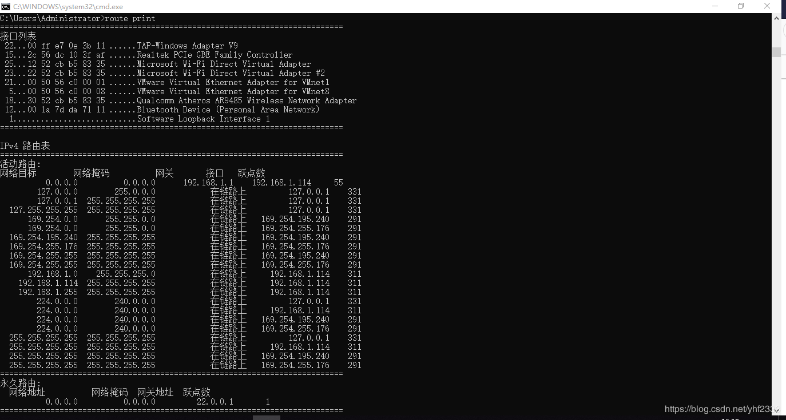

> 这是我原本在csdn上的博客，现在搬运到这里。
-  在Windows上，打开cmd，输入 route print，即可打印出路由表。

## Ipv4路由表中显示活动的路由。

  **网络目标**：显示了路由器连接的所有网段。

  **网络掩码**：显示了该网段的子网掩码，路由器通过此确定网络的地址类型。

  **网关一列**：显示了路由器需要把数据包发送给哪个ip地址，才能到达这个网段。

  **接口一列**：显示了哪个网卡连接到了合适的目的网络，该项仅显示了路由器分配给网卡的ip。

  **跃点数一列**：即跳数，指出了通常情况下，到达目标地址需要经过多少跳数的转发，一跳代表经过一个路由器。（跳数越低，路由成本越低，优先级往往就越高）。

<!-- more -->

## 第一条路由： 网络目标0.0.0.0

  这条为**缺省路由**，指出当一个数据包的目的网段不在路由表中时，路由器应该将数据包发送到的地方。

  这里这条路由指出了，当我的数据包的目的网段不在路由表中时，我会将数据包通过192.168.1.114的接口，发送到192.168.1.1这个地址。这样就把这个数据包交付给下一个路由器，由它进行转发，与我无关了。

## 第二条路由：网络目标127.0.0.0和127.0.0.1，127.255.255.255

  为**本地环路（环回地址）**

  这个网段所有地址均指向自己

## 路由：网络目标192.168.1.0

  这是路由器直连的网络。当一个数据包的目的网段是这个时，从192.168.1.114这个接口发送，即可到达目标网段。

## 中间的路由：网络目标 169.254.0.0 到169.254.255.176

  这些也是路由器直连的网络。从169.254.0.0到169.254.255.255是保留地址。

  如果你的IP是自动获取的，但是网络中没有可用的DHCP服务器，这时会临时获取到这类IP。

## 路由：网络目标192.168.1.114

  这个是**本地主机路由**，路由器收到一个目的网段是这个时，会收下这个数据包。

## 路由：网络目标192.168.1.255

  这是**本地广播路由**，当系统接收到目的网段是这个的数据包时，就会从192.168.1.114这个接口以广播的形式发出。

## 路由：网络目标224.0.0.0

  这个**组播路由**，当系统接收到目的网段是这个的数据包时，就会从127.0.0.1，192.168.1.114，169.254.195.240和169.254.255.176这几个接口以组播的形式发出。

## 路由：网络目标255.255.255.255

  这个**绝对广播路由**，当系统接收到目的网段是这个的数据包时，就会从127.0.0.1，192.168.1.114，169.254.195.240和169.254.255.176这几个接口以广播的形式发出。

***如有错误，敬请指正~***

